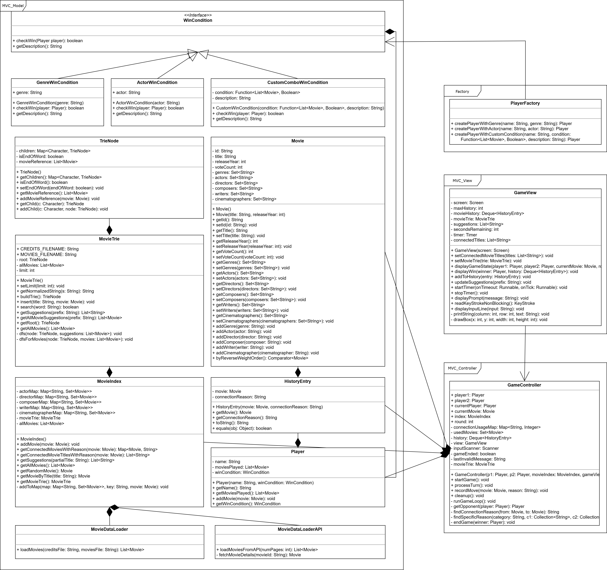

[](https://classroom.github.com/a/nK589Lr0)
[](https://classroom.github.com/online_ide?assignment_repo_id=18841672&assignment_repo_type=AssignmentRepo)

# Terminal Movie Game 🎮

A terminal-based movie connection game inspired by Cine2Nerdle, implemented in Java with the **Lanterna** library for a rich text-based UI. Two players take turns naming movies that connect based on shared actors, directors, genres, or custom rules, and the game ends when one player's win condition is satisfied.

---
## 📐 Design Overview (UML)

The following UML diagram illustrates the overall system architecture, including the relationships among `Player`, `WinCondition`, `PlayerFactory`, and various win condition strategies:


---
## 📂 Project Structure

```
.
├── .gitignore             # Ignore compiled classes, IDE config, etc.
├── README.md              # Project description and instructions
├── src/                   # Source files
│   ├── *.java             # All model, view, controller, and utility classes
│   └── GameView.java      # Terminal UI using Lanterna
├── test/                  # JUnit test files
│   └── *Test.java         # Unit tests for core components
```

---

## 🕉 Main Components

* **MVC_Model**
  * `Movie`, `Player`, `MovieIndex`, `TrieNode`, `WinCondition`, etc.
* **MVC_View**
  * `GameView` (Lanterna terminal UI)
* **MVC_Controller**
  * `GameController` (manages player turns, movie logic, win validation)
* **Utilities**
  * `MovieDataLoader`, `MovieDataLoaderAPI` for loading movie datasets

---

## 📆 Dependencies

Add the following to your Maven or manually include the JARs if not using Maven:

1. [Apache Commons CSV 1.9.0](https://mvnrepository.com/artifact/org.apache.commons/commons-csv/1.9.0)
2. [Google Gson 2.10.1](https://mvnrepository.com/artifact/com.google.code.gson/gson/2.10.1)
3. [Lanterna 3.1.3](https://mvnrepository.com/artifact/com.googlecode.lanterna/lanterna/3.1.3)

---

## ▶️ Running the Game

1. Clone the repository.
2. Ensure all dependencies are installed via your IDE or command-line build tool (e.g., IntelliJ, `mvn`, or manual JARs).
3. Run the `Main` class, or create your own launcher.

```bash
javac -cp ".:lib/*" src/*.java
java -cp ".:lib/*" Main
```

> 📝 `Main.java` should initialize players, load data with `MovieDataLoader`, create a `GameController`, and start the game.

---

## 🔪 Testing

Tests are located in the `test/` directory. Use JUnit to run tests:

```bash
javac -cp ".:lib/*" test/*.java
java -cp ".:lib/*" org.junit.runner.JUnitCore YourTestClassName
```

---

## ⌘️ Features

* ✅ Interactive Lanterna UI with autocomplete for movie names
* ✅ Autocomplete suggestions using Trie and prefix matching
* ✅ Supports multiple win conditions (genre-based, actor-based, director-based, or custom)
* ✅ Movie connection validation logic
* ✅ Timer & round tracking
* ✅ Clean MVC architecture with separation of logic, view, and data
* ✅ Factory-based player creation

---

## 🧠 Design Patterns Used

| Pattern             | Application                                                                                          |
|---------------------|------------------------------------------------------------------------------------------------------|
| **Strategy Pattern**| `WinCondition` interface with strategies like `GenreWinCondition`, `ActorWinCondition`, etc. Each `Player` uses a strategy to determine their win condition. |
| **Factory Pattern** | `PlayerFactory` encapsulates logic for creating players with different win strategies.              |
| **MVC Architecture**| The code is cleanly separated into Model, View, and Controller for better maintainability and testability. |

---

## 🧑‍💻 Collaborators

- [@Jianing Yin](https://github.com/CatherineYin1213)  
- [@Vera Zhang](https://github.com/VeraZhangYH)  
- [@Ashley Wang](https://github.com/AshleyWang29)


